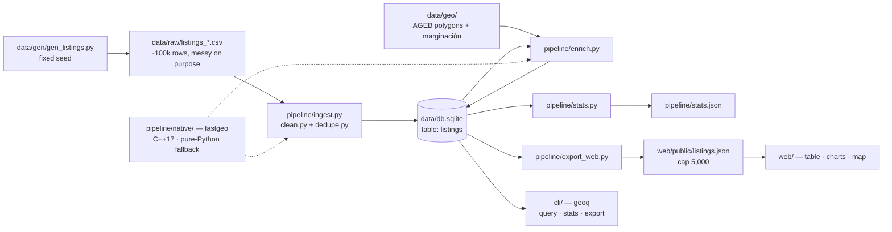

# Architecture

Four pieces that meet at two artifacts. The Python pipeline owns `data/db.sqlite`; the CLI
reads it; the web app reads a JSON slice of it. `fastgeo` is a leaf dependency of the
pipeline only. Nothing else crosses.

---

## Code layout

```
geo-lab/
  web/                       Vite + TypeScript explorer (no UI framework)
    src/main.ts              table + filter box + Tabla/Gráficas/Mapa tabs
    src/data.ts              loads listings.json, client-side filter + sort
    src/charts.ts            price histogram, median price/m² by colonia (plain SVG)
    src/map.ts               Leaflet map, capped/sampled markers
    public/listings.json     committed pipeline export (5,000 rows)
  cli/                       geoq query tool (TypeScript, better-sqlite3)
    src/cli.ts               argv → subcommand dispatch, usage, error formatting
    src/commands/            query.ts · stats.ts · export.ts
    src/parser/lexer.ts      hand-written tokenizer
    src/parser/parser.ts     recursive descent → AST
    src/parser/eval.ts       AST → SQL WHERE clause with bound parameters
    src/db.ts                read-only sqlite open, --db resolution
  pipeline/                  Python 3.11+, stdlib + sqlite3 only
    ingest.py clean.py dedupe.py stats.py enrich.py export_web.py
    geo_backend.py           the fastgeo import chokepoint
    tests/                   pytest, incl. test_parity.py
  pipeline/native/           fastgeo C++17 module
    fastgeo/geo.cpp          point_in_polygon, batch_assign, haversine_matrix
    fastgeo/simhash.cpp      simhash64 + hamming
    bindings.cpp             pybind11 module `fastgeo`
    fallback/fastgeo_py.py   pure-Python reference — this is the spec
  data/
    gen/gen_listings.py      synthetic generator, fixed seed, byte-reproducible
    gen/gazetteer.py         real CDMX colonias + curated GDL/MTY lists
    raw/listings_*.csv       generated source CSVs (~100k rows, deliberate messiness)
    db.sqlite                built artifact, committed on purpose
    geo/agebs_cdmx.geojson   real INEGI urban AGEB polygons (2,431, CDMX)
    geo/marginacion_cdmx.csv real CONAPO marginación rows for those AGEBs
```

## Canonical data flow



Deep dive: [[overview]].

## State boundaries

- **The pipeline is the only writer** of `data/db.sqlite`. `geoq` opens it **read-only**
  (`readonly: true, fileMustExist: true`, `cli/src/db.ts`).
- **The web app has no database.** It fetches one static JSON array and does all filtering,
  sorting, charting, and map sampling client-side, in memory. There is no server round-trip
  after load.
- **Web UI state is a single module-scope `state` object** in `web/src/main.ts`
  (`all`, `query`, `sortField`, `sortDir`, `activeTab`) with one `render()` that rebuilds
  from it. No framework, no store, no reactivity layer.
- **`fastgeo` is a leaf.** Only `pipeline/dedupe.py` and `pipeline/enrich.py` need it, and
  they reach it **exclusively** through `pipeline/geo_backend.py` ([[contracts]]).

## Ownership boundaries

| Owner | Owns | Must not |
|---|---|---|
| `pipeline/` | The `listings` schema, `data/db.sqlite`, `stats.json`, `listings.json` | Import `fastgeo` directly (go through `geo_backend.py`) |
| `cli/` | The filter language and its SQL compilation | Write to the database |
| `web/` | Presentation and the browser-side filter | Assume the JSON is unbounded (it's capped at 5,000) |
| `pipeline/native/` | The five fastgeo functions and their parity | Diverge from `fallback/fastgeo_py.py` — that file is the spec |
| `data/gen/` | Synthetic data generation | Import `fastgeo`/`geo_backend` (deliberately independent of what it generates fixtures for) |

## The contracts

Five cross-boundary contracts must be changed on all sides at once, never one-sided:
the fastgeo import chokepoint, the fastgeo API, the web data shape, the stats shape, and
`geoq`'s `--db` resolution. They are written out in full in [[contracts]].

---

## See also

- ↑ [[PRODUCT]] · [[RUNTIME]]
- [[overview]] · [[pipeline]] · [[fastgeo]] · [[query-engine]] · [[web-app]] · [[contracts]]
- [[DATA]] · [[AUTH]] · [[ENGINEERING]] · [[TESTING]] · [[DESIGN]]
- [[Decisions Index]]
- ↩ [[Home]]
