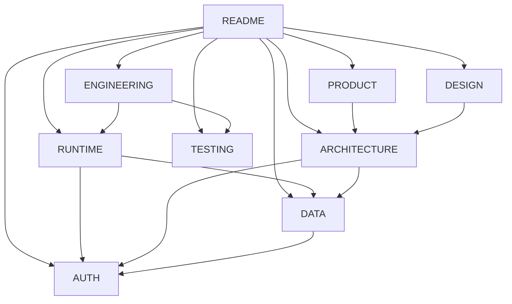

# geo-lab docs vault

An Obsidian-style vault that also reads as a plain folder on GitHub. Open `docs/` as the
vault root in Obsidian (**Open folder as vault** → pick `docs/`); `.obsidian/` is committed,
so the graph colours, backlinks, and bookmarks work immediately.

In Obsidian → start at [[Home]]. On GitHub → keep reading.

External entry points: [`AGENTS.md`](../AGENTS.md) · [`CLAUDE.md`](../CLAUDE.md) ·
[project README](../README.md).

## Read order

**PRODUCT → RUNTIME → ARCHITECTURE → DATA → AUTH → ENGINEERING → TESTING → DESIGN**



| Doc | Covers |
|---|---|
| [PRODUCT](PRODUCT.md) | What geo-lab is, audiences, surfaces, glossary, roadmap |
| [RUNTIME](RUNTIME.md) | Stack, commands, env, setup, Pages deploy, CI |
| [ARCHITECTURE](ARCHITECTURE.md) | Layout, dataflow, state and ownership boundaries |
| [DATA](DATA.md) | SQLite schema, pipeline layers, real-vs-synthetic provenance |
| [AUTH](AUTH.md) | There is none — plus the trust boundaries that do exist |
| [ENGINEERING](ENGINEERING.md) | Language rules, CI, the non-negotiables |
| [TESTING](TESTING.md) | Runners, the parity suite, coverage bar |
| [DESIGN](DESIGN.md) | Tokens, type, components (spec-compliant `design.md`) |

Each top-level doc is a short summary that links into the deeper folder content.

## Folders

```
docs/
├── .obsidian/          Obsidian config (graph colours, plugins, bookmarks)
├── Home.md             Vault MOC — open this first in Obsidian
├── README.md           This file — GitHub folder index
│
├── PRODUCT.md          ┐
├── RUNTIME.md          │
├── ARCHITECTURE.md     │  Flat top-level domain summaries
├── DATA.md             │  (each links into the deeper folder docs below)
├── AUTH.md             │
├── ENGINEERING.md      │
├── TESTING.md          │
├── DESIGN.md           ┘
│
├── architecture/       overview · pipeline · fastgeo · query-engine · web-app · contracts
├── conventions/        typescript-style · python-style · cpp-native · styling-system · git-and-pr
├── workflows/          regenerate-data · add-a-filter-field · add-a-region · build-fastgeo · diagnose-parity-failure
├── quality/            performance · accessibility · security · data-integrity
├── decisions/          ADRs 0001–0005
├── upgrades/           immediate · backlog
│
├── filter-language.md  the geoq query grammar (long-form reference)
├── data-notes.md       dataset sources, URLs, retrieval dates, licenses
├── dev-notes.md        the author's running log — decisions, benchmarks, mistakes
└── development.md      redirect stub — the old dev guide, now split across the vault
```

The three long-form references above predate the vault and remain canonical.
[`dev-notes.md`](dev-notes.md) in particular is the best "why is it like this" source in the
repo. [`development.md`](development.md) is a [[Development Guide]] stub kept so older links
still land somewhere useful — its content was redistributed, not deleted.

Skill inventory: [`../skills-lock.json`](../skills-lock.json).
